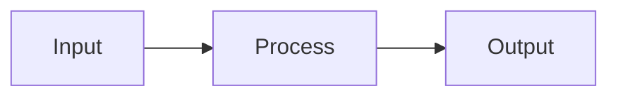

<!--
NOTES CONVENTION — the one-page reading that supports a module. NOT a lab, NOT a lecture dump.
Notes are DISTILLED: shorter than the source, plain language, short sentences, every term defined.
Match the warmth and length of the module README/lab. If it's longer than those, cut it.

Shape (keep this order):
  1. One-paragraph intro — why this matters to the learner, in plain words.
  2. Key ideas — each as a short heading + a few sentences + an everyday analogy.
       Flag any load-bearing analogy with: <!-- HUMAN: review/replace analogy -->
  3. Mermaid diagram(s) for anything structural — ORIGINAL, never a copy of the source figure.
  4. "See it yourself" — a tiny, correct, verified demonstration (only where it fits the module's tooling).
  5. Glossary note — every new term also added to resources/glossary.md.
  6. Source & licence — record the source and its licence at the foot; flag NC/SA/ND/commercial limits.

Delete these comments and every <...> placeholder before shipping.
-->

# Notes — M<n>: <Module title>

<One short paragraph: what this is and why a beginner should care. Plain words.>

## <Key idea 1>
<A few short sentences. Everyday analogy if it helps.>
<!-- HUMAN: review/replace analogy, if one is load-bearing -->

## <Key idea 2>
<…>

## How it fits together

<One line reading the diagram in plain words.>

## See it yourself
<A tiny, verified demonstration appropriate to THIS module's tooling. Omit if none fits.>

---
**New words** (also in `resources/glossary.md`): <term, term, term>

**Source:** <title — author — year>. **Licence:** <licence + any NC/SA/ND/commercial flag for the human>.
*All text re-expressed in our own words; diagrams are original.*
