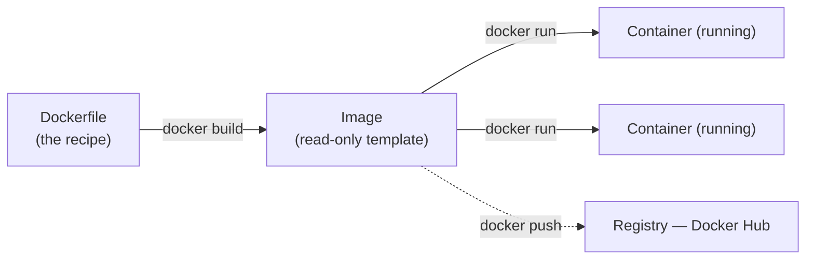

# Notes — M10: containers

"But it works on *my* machine!" is the oldest groan in software — and containers are its modern cure. You've already met the pieces: the **OS fencing trick** in M4 (namespaces + cgroups) and the heavier cousin, **VMs**, in M9. Now you put them together. A container packages an app with everything it needs and runs it *identically anywhere* — which is why it's become the unit modern software ships in.

## The problem: "works on my machine"
An app needs more than itself: the right libraries, versions, and settings around it. Move it to a computer where any of that differs and it breaks. This wasted so many hours it became a meme.

## A container = the app **plus everything it needs**, sealed
A **container** bundles an application together with its dependencies and seals it off from the rest of the computer. Two properties do the work:
- **Isolation** — fenced off; it can't clash with other apps or disturb the host.
- **Portability** — *build once, run anywhere*: your laptop, a server, the cloud — same box, same behaviour.

Like a shipping container: standard on the outside, so any ship, truck, or crane handles it the same, whatever's inside. <!-- HUMAN: review/replace the shipping-container analogy. -->

## Images vs containers (the one to get right)
- An **image** is the **read-only template** — the app and all its ingredients packaged together (like a recipe).
- A **container** is a **running instance** made from an image (the cooked dish).

From one image you start **many** containers; delete a container and the image is untouched. Images are built from a plain-text recipe called a **Dockerfile**, and stored/shared in a **registry** (the big public one is **Docker Hub**).

## It's the OS trick from M4 — the light cousin of M9's VM
A container isn't a tiny computer. It's the **OS fencing an ordinary process** with **namespaces** (what it can see) and **cgroups** (what it can use) — exactly the mechanism from M4. Compare with a **VM** (M9):

| | Virtual machine (M9) | Container |
|---|---|---|
| Own OS? | full guest OS | shares the host OS |
| Size / start | gigabytes / ~a minute | megabytes / ~a second |
| Isolation | very strong | lighter |

So a VM is a whole computer; a container is a fenced-off process. In the cloud (M8) you often get **both** — containers running inside VMs.

## Why containers run modern IT
The same image runs the same on a developer's laptop and in production, deploys in seconds, and packs many-per-server efficiently. That consistency is why containers became **the** standard way to ship software.

## Orchestration: containers at scale (Kubernetes)
Running *one* container is easy. Running *hundreds* across many servers — restarting crashed ones, scaling up under load, rolling out updates — needs an **orchestrator**. **Kubernetes** is the dominant one: think of it as the autopilot for fleets of containers in the cloud. You won't run it here, but you should know the name and what it's for — it's how M8's cloud runs apps at scale. <!-- HUMAN: review/replace the "autopilot" analogy. -->

## See it yourself
In your Codespace (Docker is built in), `docker run hello-world` pulls a tiny image from Docker Hub and runs it; `docker run -p 8080:80 nginx` runs a **real web server** you can open in a browser; and a two-line **Dockerfile** lets you build and run **your own** image. That's the whole lifecycle, in the lab.

<b>Go deeper (optional — not needed for today's win)</b>

- An image is built from stacked **read-only layers** (copy-on-write), so many images/containers share storage cheaply.
- A container forgets its changes when deleted — use **volumes** to keep data.
- **Docker Compose** runs several containers together (e.g. an app + its database) from one file.
- **OCI** is the open standard so images built with Docker run on other tools too (Podman, etc.).

---
**New words** (also in `resources/glossary.md`): container, image, Dockerfile, registry, Docker, Docker Hub, isolation, portability, port, orchestration, Kubernetes. (Callbacks: namespaces/cgroups (M4), VMs (M9), the cloud (M8).)

**Source:** original — written for this course (concepts draw on Docker's docs and intro decks, re-expressed). The hello-world, nginx, and custom-image build were verified by running them in the course's Docker environment; diagrams are original.
