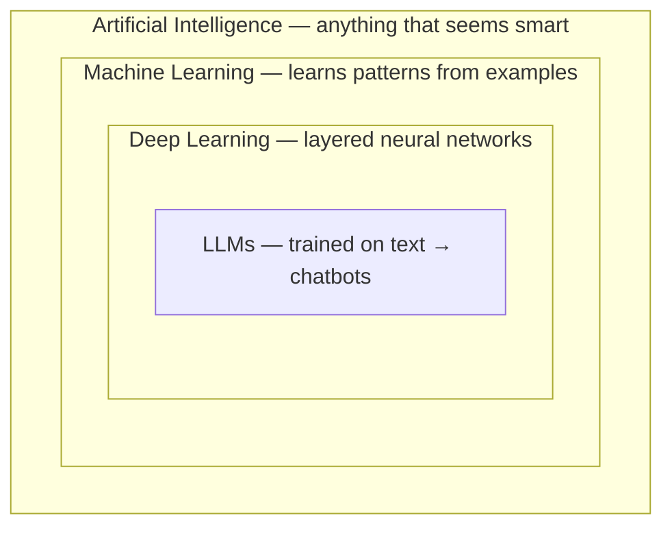
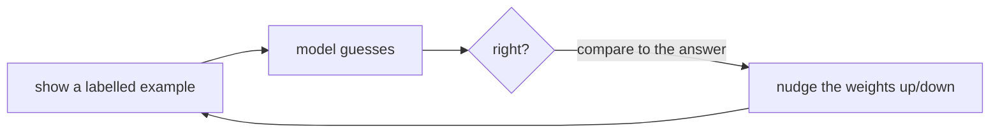

# Notes — M11: AI Fundamentals I — what AI actually is

"AI" is splashed on everything and, by itself, means almost nothing. These notes clear up the buzzwords — AI vs machine learning vs deep learning vs LLMs — explain *why* AI suddenly got so good, and set up the lab where you **train a model with your own examples and watch it learn**. No math, no code.

## The buzzwords are nested dolls, not rivals
They don't compete — they sit inside each other:

- **Artificial Intelligence (AI)** — the umbrella: any computer doing something that *seems* smart.
- **Machine Learning (ML)** — today's most successful kind of AI: instead of being handed step-by-step rules, the computer **learns patterns from examples**.
- **Deep Learning (DL)** — ML done with **neural networks** stacked in many layers. Powers most of today's breakthroughs.
- **Large Language Models (LLMs)** — a deep-learning model trained on enormous text to predict words: the engine behind chatbots (the focus of M12).

## The big shift: telling vs showing
The **old** way of programming is to write the rules yourself: *"if the email says 'free money', mark spam."* That collapses on messy tasks — try writing rules that reliably spot a cat in a photo. You can't.

The **machine-learning** way flips it: you **show** the computer thousands of labelled examples (cat / not-cat) and it works out the pattern *itself*. **Teach by showing, not telling.** That single shift is why modern AI took off.

## Two phases: training, then inference
- **Training** — the *learning* phase: the model sees many examples and adjusts itself to get better. Slow, done occasionally, and the expensive part.
- **Inference** — the *using* phase: you hand the trained model something new and it makes a prediction. Fast, and happens every time you use it.

Like **studying for an exam** (training) vs **answering on exam day** (inference). <!-- HUMAN: review/replace the exam analogy. -->

## Neural networks, without the math
A **neural network** is a big web of simple connected units ("neurons"). Each connection has a strength — a **weight**. Training is a loop:

Show an example, check the guess, nudge the weights toward the right answer — repeated *millions* of times. That's all "learning" is here: tuning a vast number of little dials until the output is right. No understanding, no magic — just adjustment at enormous scale. (Which is also why AI can be **confidently wrong**: it learned patterns, it doesn't *know* anything.)

## Why now? What made the current AI wave
Neural networks are decades old. What changed recently is **three things colliding**:
1. **Data** — the internet gave us oceans of text and images to learn from.
2. **Compute** — **GPUs** (callback to M1: thousands of small cores doing the same math in parallel) made training huge networks feasible. AI training *is* "the same multiplication across millions of numbers" — exactly what GPUs do. That's why companies buy warehouses of them.
3. **A breakthrough design — the transformer** (2017) — a network design that's especially good at handling context and *scales* beautifully: feed it more data and more GPUs and it keeps getting better.

More data + more GPUs + transformers = the leap from "meh" to ChatGPT. None of it is magic; it's M1's hardware and this module's ideas, at staggering scale.

## Bias & data quality (this matters, it's not a footnote)
A model is a **mirror of its training data**. Feed it lopsided examples and you get a lopsided model — e.g. a face system trained mostly on one group works worse for everyone else; a hiring model trained on biased history repeats that bias. **Garbage in, garbage out**, but with real consequences for real people. So the sharpest question to ask about any AI is: ***what data was it trained on?***

## See it yourself
In the lab you'll open **Teachable Machine**, show it examples of two things (say 👍 vs 👎 on your webcam), click **Train**, and watch it guess correctly in real time — then deliberately **fool it** to feel how much its examples (and their bias) matter. You'll have *watched* training and inference happen.

<b>Go deeper (optional — not needed for today's win)</b>

- **Supervised** learning uses labelled examples (what the lab does); other styles (unsupervised, reinforcement) learn differently.
- **Overfitting:** a model that "memorizes" its examples instead of learning the general pattern — great on practice, bad on new data.
- **Parameters:** the weights are the model's "size" — today's big models have billions to trillions of them.
- A transformer's key trick is called **attention** — weighing which parts of the input matter most for each prediction.

---
**New words** (also in `resources/glossary.md`): artificial intelligence (AI), machine learning (ML), deep learning (DL), large language model (LLM), neural network, model, training, inference, weights, labelled data, bias, transformer. (Callback: GPU (M1).)

**Source:** original — written for this course. No third-party text or figures; the diagrams are original. (The lab uses Google's free **Teachable Machine**.)
