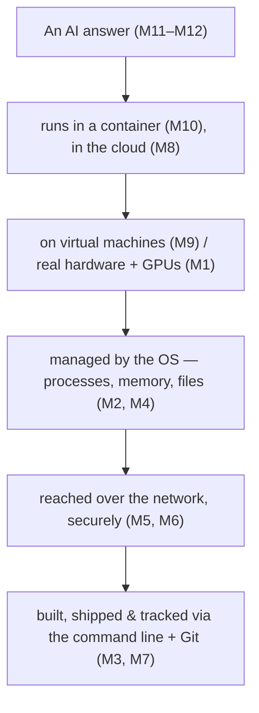

# Notes — M12: how LLMs work (+ tying the whole course together)

In M11 you watched a model learn from examples. An **LLM** — the thing behind chatbots — is that same idea at staggering scale, trained on a huge slice of human text. These notes explain the *one trick* it does, why that makes it brilliant, why it confidently makes things up, how to use it responsibly — and then we tie the **entire course** together.

## An LLM is a next-word predictor
At heart an LLM does just one thing: given some text, **guess the most likely next chunk of text** — add it, then guess again, and again. That's it. Trained on so much writing (using the transformers and GPUs from M11), those guesses string together into fluent, genuinely useful answers.

It's **autocomplete turned up to eleven**. <!-- HUMAN: review/replace the "autocomplete on steroids" analogy. -->

## Tokens: the pieces it predicts
LLMs don't think in letters or whole words — they work in **tokens**: small chunks of text. A common word is one token; a long or rare word gets split, e.g. `unbelievable` → `un` + `believ` + `able`. The model predicts **one token at a time**.

Tokens also explain a key limit: a model can only hold so many tokens in view at once — its **context window**. Give it more than that and the earliest stuff falls out of sight (it "forgets" the start of a long conversation).

## Why prompts matter
Since the model is *continuing your text*, what you give it steers everything. A vague prompt gets a vague continuation; a clear prompt — with context, a role, and examples — gets a far better answer. **Prompting is the skill of setting up the text so the most likely continuation is the one you want.** (Course 02 goes deep.)

## Why it makes things up — "hallucination"
The crucial part: an LLM predicts **plausible** text. It does **not** look things up, and it has **no built-in sense of true vs false**. So when it doesn't know, it doesn't stop — it generates something that *sounds* right anyway. That's a **hallucination**: invented facts, fake citations, confident nonsense.

It isn't lying — it's doing exactly what it was built to do (produce likely-sounding text). Two more limits feed this:
- **Training cutoff** — a model only "knows" text up to when it was trained; ask about later events and it may guess.
- **Bias** (M11) — it absorbs the biases in its training text.

So: **brilliant for drafting, explaining, brainstorming — never trust it blindly for facts. Verify.**

## Using it responsibly
Powerful tools need judgment. A short code of conduct:
- **Verify facts** before you rely on or share them (hallucinations look identical to truth).
- **Don't paste secrets** — passwords, private data, confidential work — into a chatbot; it leaves your control (callback M6).
- **Mind bias and fairness** — don't use it to make high-stakes decisions about people unchecked.
- **Be honest** about when AI wrote something, and remember training and running these models has real **energy and cost**.

## The whole course, in one picture
Every layer you learned holds up an AI answer:

You can now follow any modern computing thing from **electricity and parts (M1)** → the **OS (M2/M4)** → **typing commands (M3)** → **the network, secured (M5/M6)** → **version control & the cloud (M7/M8)** → **VMs & containers (M9/M10)** → up to **a model that learned (M11)** and **an LLM that talks (M12)**. You've touched every layer.

## See it yourself
In the lab you'll paste a sentence into a **token visualizer** and see the chunks, then chat with an LLM (e.g. **claude.ai**): compare a lazy prompt with a rich one, and deliberately **catch a hallucination** by asking for sources on something obscure.

<b>Go deeper (optional — not needed for today's win)</b>

- **Same prompt, different answers:** models add a little randomness (often called *temperature*), so replies vary.
- Even fancy **"reasoning"** is still next-token prediction, just prompted to show its working.
- **RAG** (retrieval-augmented generation) gives a model your documents to quote from — a fix for hallucination you'll build in Course 02.
- Running these models is what M8's cloud GPUs are for, at massive scale.

---
**New words** (also in `resources/glossary.md`): token, next-token prediction, prompt (to an LLM), context window, hallucination, training cutoff.

**Source:** original — written for this course. No third-party text or figures; the diagram is original. (The lab uses a public chatbot such as claude.ai and a token-visualizer tool.)
