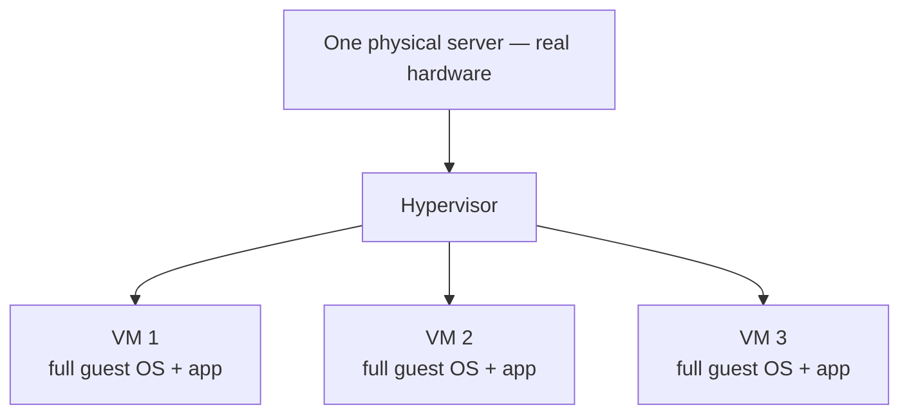
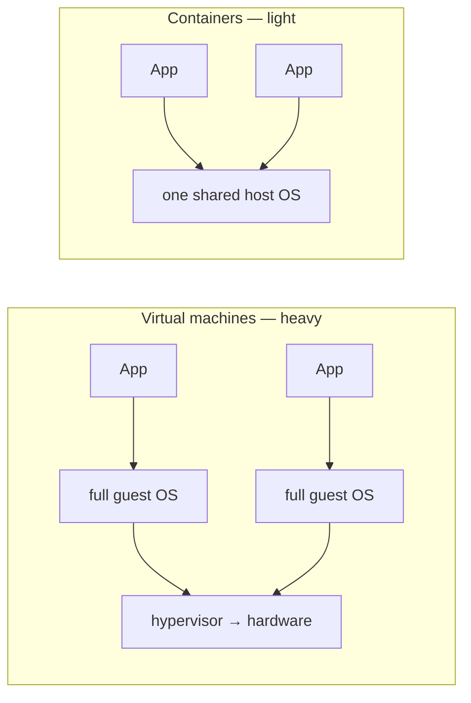

# Notes — M9: virtualization & VMs

How does one physical server in a data center become 50 rentable cloud computers (M8)? And what's *really* underneath a container (M4, and M10 next)? The answer to both is **virtualization** — making one real computer act like many. This module is the layer beneath the cloud and containers; once you see it, both stop being magic.

## Virtualization: one machine pretending to be many
**Virtualization** is software that creates fake — "virtual" — computers on top of one real one. Each virtual computer believes it has its own hardware and runs as if it were a whole, separate machine. One powerful box can host many independent ones.

## Virtual machines & the hypervisor
A **virtual machine (VM)** is a complete fake computer: its own **guest operating system**, its own pretend hardware, running on top of a real machine (the **host**). The software that creates and runs VMs — slicing the real CPU, RAM, and disk among them — is the **hypervisor**.

This is how you run Windows in a window on a Mac, or how one big server runs 50 isolated Linux machines. Each VM is walled off from the others.

## How virtualization made the cloud possible
Before virtualization, you ran one app per physical server — and most sat mostly idle, wasting expensive hardware. Virtualization changed the economics: **chop one powerful server into many isolated VMs**, use the hardware fully, and **rent the VMs out by the hour**. That *is* how the cloud (M8) began — AWS started by renting virtual machines. No virtualization, no cloud.

## VMs vs containers — the key contrast (→ M10)
You met containers in M4 (namespaces + cgroups) and will build them in M10. Here's how they differ from VMs — the single most useful comparison in modern infrastructure:

| | Virtual machine | Container |
|---|---|---|
| Carries its own OS? | **Yes** — a full guest OS | **No** — shares the host's OS kernel |
| Size | gigabytes | megabytes |
| Start time | ~a minute (it boots) | ~a second |
| Isolation | very strong (whole fake machine) | lighter (fenced-off process) |

So: **a VM is a whole separate computer; a container is just a fenced-off process sharing the host's OS.** A useful picture: VMs are separate **houses** (each with its own foundation and plumbing); containers are **apartments** in one building (sharing the structure). <!-- HUMAN: review/replace the houses/apartments analogy. -->

Modern reality: it's often **both** — containers running *inside* VMs in the cloud, combining strong isolation with light, fast deployment.

## See it yourself
In your Codespace, a container shows the contrast directly: an `alpine` container is only ~**13 MB**, starts in **under a second**, and `uname` inside it reports the **host's Linux kernel** — proof it carries no OS of its own. A VM doing the same job would be **gigabytes** and take a minute to boot.

<b>Go deeper (optional — not needed for today's win)</b>

- **Type-1** hypervisors run directly on the hardware (data-center servers); **type-2** run as an app on your OS (e.g. VirtualBox on your laptop).
- VMs can be **snapshotted** and **migrated** live to another server — a superpower for the cloud.
- Containers *feel* like lightweight VMs but aren't: no guest OS, so a Linux container needs a Linux host (that's why Docker on a Mac/Windows quietly runs a small Linux VM).

---
**New words** (also in `resources/glossary.md`): virtualization, virtual machine (VM), hypervisor, guest OS, host OS. (Callbacks: namespaces/cgroups (M4), the cloud (M8), containers (M10).)

**Source:** original — written for this course. The container-footprint demonstration was verified by running it in the course's container environment; the diagrams are original.
