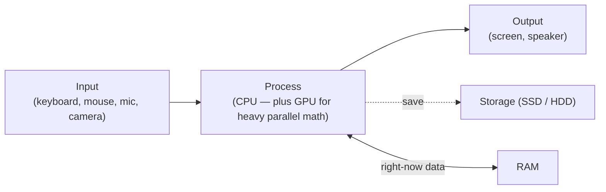
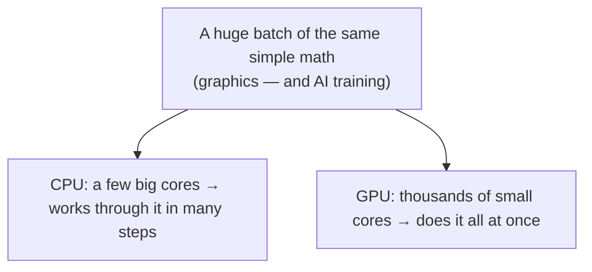

# Notes — M1: What a computer really is

A computer feels like magic. It isn't — underneath it's a handful of parts doing simple jobs astonishingly fast. This module goes past "it has a CPU": you'll learn what **cores**, **clock speed**, **SSDs**, and **GPUs** actually mean, and *why modern AI runs on GPUs*. Once you can read these, you can look at any device — phone, laptop, or a cloud server — and know what you're seeing.

## A computer is a *programmable* machine
A **computer** is a general-purpose machine that follows a list of instructions — a **program** — to turn **input** into **output**, and can **store** the result.

The "general-purpose" part is the real magic. The *same* hardware becomes a calculator, a camera, a video game, or an AI — just by running different **software**. Nothing physical changes; only the instructions do.

- **Hardware** = the physical parts you could touch (chips, screen, keyboard).
- **Software** = the instructions running on that hardware (apps, the operating system, this page).

*(Deeper: software is ultimately just numbers sitting in memory that the CPU reads as instructions. There's no hard line between "data" and "program" — both are bits.)*

## The four jobs every computer does

Input → process → output, with RAM as the fast working space and storage as the keep-forever space. Every part below has one of these jobs.

## The CPU — the worker (and what "cores" and "GHz" mean)
The **CPU** (central processing unit, or "processor") does the actual work: it reads instructions and performs arithmetic and logic, billions of times a second. Think of it as the worker who handles every task.

Two numbers describe a modern CPU:

- **Clock speed (GHz)** — how many basic steps it takes per second. *2.4 GHz ≈ 2.4 billion ticks per second.* Higher clock = faster at each step.
- **Cores** — a modern CPU isn't one worker but several, called **cores**, each able to work independently. A **4-core** or **8-core** chip can genuinely do that many things *at the same time*. (You'll often also see "threads" — a trick that lets each core juggle two tasks, so an 8-core chip may show **16 threads**.)

So "8 cores at 2.4 GHz" means eight workers, each taking ~2.4 billion steps a second. More cores is why your computer stays smooth with many apps open — and it's the same idea, taken to an extreme, that powers GPUs and AI below. *(Analogy: cores are cooks in a kitchen; clock speed is how fast each cook works.)*

## RAM — the working memory (the desk)
**RAM** is the computer's fast, short-term memory: it holds whatever you're doing *right now* — open tabs, the app in front of you. It's wiped clean the moment power is lost. More RAM means more can be open at once before things slow down. **RAM forgets.**

## Storage — the keep-forever memory, and SSD vs HDD
**Storage** holds your files, photos, and apps, and keeps them even when the power is off. **Storage remembers.** It comes in two kinds, and the difference is huge:

- **HDD (hard disk drive)** — spinning magnetic platters with a moving arm. Cheap and roomy, but **slow** and mechanical (it can wear out). The old standard.
- **SSD (solid-state drive)** — no moving parts, just flash-memory chips. **Much faster** and more durable. It's why a modern laptop boots in seconds and apps open instantly. **SSD is now standard**; HDDs hang on mainly for cheap bulk storage.

> **RAM vs storage** trips everyone up: RAM is small, very fast, and forgets; storage is large, slower, and remembers. Both are "memory," but they do opposite jobs.

## Bits & bytes — the language underneath
Deep down a computer knows only two things: **0** and **1** — off or on, like a light switch. A single 0-or-1 is a **bit**. Eight bits make a **byte**, about one letter's worth.

Everything else is just enormous piles of bits: this text, a photo (millions of bits describing pixel colours), a song, even an AI model and the CPU's own instructions. Sizes climb in ~1000× steps:

| Unit | Roughly |
|---|---|
| byte | one letter |
| KB | a paragraph |
| MB | a photo |
| GB | a movie-ish |
| TB | ~1000 GB |

So "64 GB of RAM" means room for ~64 billion bytes of right-now work.

## GPUs — and why AI runs on them
This is the modern part most people miss. A **GPU** (graphics processing unit) was invented to draw graphics for games, but it now powers AI. The reason is the difference between a CPU and a GPU:

- A **CPU** has a *few powerful* cores — brilliant at doing one complicated thing after another.
- A **GPU** has *thousands of small* cores — brilliant at doing the *same simple* calculation across a huge pile of numbers, all at once. That "all at once" is called **parallelism**.

It turns out both drawing graphics *and* training a neural network (M11) are the same shape of work: "multiply these millions of numbers." So GPUs are perfect for AI — which is exactly why the recent AI boom rides on GPUs, and why companies fill data centers with them.

*(Many laptops have a modest GPU built into the CPU; gaming and AI machines add a powerful separate "discrete" GPU. Some have both.)*

## The same parts, from phone to data center
Here's the unlock: a phone, a laptop, a server, and a cloud data center are all the *same ideas* — CPU, RAM, storage, often a GPU — just at different scales. A **data center** is simply thousands of these computers working together in a warehouse. That's what "the cloud" really is (M8). Learn the parts once and you understand all of them.

## See it yourself
Open your computer's **About** screen (Mac: Apple menu → About This Mac; Windows: Settings → System → About + Task Manager → Performance). Find five things: the **processor** (its GHz and core count), the **memory** (GB of RAM), the **storage** (size, and whether it's an **SSD**), and the **graphics** (your **GPU**). You're reading the exact specs we just explained.

<b>Go deeper (optional — not needed for today's win)</b>

- A CPU is built from **billions of transistors** — microscopic on/off switches. That's how "0s and 1s" become physical.
- For ~50 years chips got faster every year (**Moore's law**). That's slowing, so makers add **more cores** instead of just more GHz — which is why parallelism matters more than ever.
- The CPU also has tiny ultra-fast memory called **cache** that sits between it and RAM.
- **Apple Silicon (ARM)** chips put CPU, GPU, and memory on one piece of silicon ("system on a chip"), which is why they're fast and power-efficient.

---
**New words** (also in `resources/glossary.md`): CPU core, clock speed (GHz), thread, GPU, parallelism, SSD, HDD, transistor, data center. (Plus the M1 basics: hardware, software, CPU, RAM, storage, bit, byte, input/output/process.)

**Source:** original — written for this course. No third-party text or figures; the diagrams are original.
