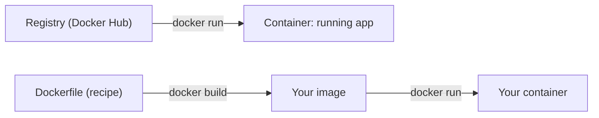

# Lab — M10: enter containers (in your Codespace)

**Two parts:** 10a (run apps in containers) and 10b (build your own image).
**You'll need:** your **Codespace** — **Docker is built in**, nothing to install. **Work in your breakout pair.**
New to the Codespace? See **[How to open it](../../resources/install-guides/codespaces.md)**.

> Heads up: containers are sealed, throwaway boxes — anything you do is `docker rm`-able and remakeable.
> You can't make a mess that won't wipe away.

### What you'll do
Part 10a runs a ready-made image; Part 10b builds your own from a Dockerfile:


---

# Part 10a — Run a real app in a container (~30 min)

## Step 1 — Check Docker is there
```text
$ docker --version
```

✅ **You should now see:** a version line (e.g. `Docker version 28.x …`). In a Codespace, Docker is already installed and running.

## Step 2 — Run your first container
```text
$ docker run hello-world
```

✅ **You should now see:** a message starting **`Hello from Docker!`**, after lines about pulling the image from Docker Hub. Docker fetched a tiny **image** from a **registry** and ran it as a **container**.

## Step 3 — Run a *real* app (a web server)
```text
$ docker run -d -p 8080:80 nginx
```
(`-d` = background; `-p 8080:80` connects port 8080 to the app inside.)

✅ **You should now see:** a long container-ID string. nginx (a real web server) is now running.

## Step 4 — Visit it in the browser
Your Codespace will offer to open **port 8080** (a popup, or the Ports tab). Open it.

✅ **You should now see:** the **"Welcome to nginx!"** page — a real web server, in a box, started with one line. 🎉

## Step 5 — See it, then stop it
```text
$ docker ps
$ docker stop <paste the container ID>
```

✅ **You should now see:** `docker ps` lists your running nginx; after `stop`, the page no longer loads. (`docker rm <id>` discards it.)

---

# Part 10b — Build and ship your own image (~30 min)

## Step 6 — Make a project with a page
```text
$ mkdir my-site && cd my-site
$ echo "<h1>Hello from MY container!</h1>" > index.html
```

✅ **You should now see:** `ls` lists `index.html`. (Edit it to say anything.)

## Step 7 — Write a Dockerfile (the recipe)
Create a file named exactly `Dockerfile` with two lines:
```dockerfile
FROM nginx
COPY index.html /usr/share/nginx/html/index.html
```
(`FROM nginx` = start from the nginx web server; `COPY` = drop your page inside.)

✅ **You should now see:** `ls` lists both `Dockerfile` and `index.html`.

## Step 8 — Build your image
```text
$ docker build -t my-site .
```

✅ **You should now see:** build steps ending in `naming to docker.io/library/my-site` / `FINISHED`. **You built an image.**

## Step 9 — Run your image
```text
$ docker run -d -p 8080:80 my-site
```
Open port 8080 again.

✅ **You should now see:** **your own page** — "Hello from MY container!" — instead of the default nginx page. You packaged your app into a box and ran it.

## Step 10 — Clean up
```text
$ docker ps
$ docker stop <your container id>
```

✅ **You should now see:** the page stops loading; `docker images` still lists `my-site` — ready to run again, or share so it runs on *anyone's* machine.

---

## 🎉 Your win
You ran a real app in a container **and** built your own image from a Dockerfile and ran it — a box that
runs the same anywhere. That's the cure for "but it works on *my* machine."

**Post it to the chat wins board:** *"I shipped a box that runs anywhere! 📦"*

## Take-home (optional)
Change `index.html`, run `docker build -t my-site .` again, and re-run it. The recipe rebuilds the same
image every time — that reproducibility is the whole point.
