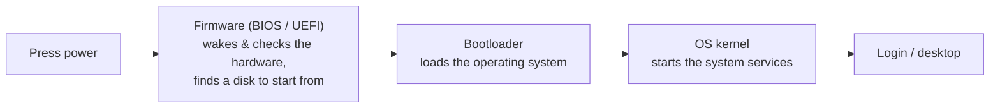
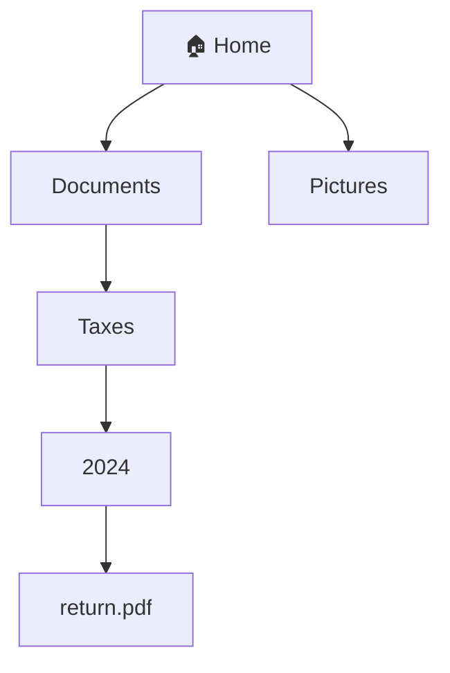

# Notes — M2: the operating system, booting, & the filesystem

In M1 you met the parts. But raw parts do *nothing* on their own — pressing power on a bare machine just heats up silicon. Something has to wake the hardware, run your programs, and organize your stuff. That something is the **operating system**. This module goes deeper than "the OS runs things": you'll see **how your computer goes from a dead slab to a desktop** (firmware + the boot sequence), what the OS actually manages, and how files are *really* organized so you can find anything on purpose.

## What the operating system actually does
The **operating system (OS)** is the master program sitting between you and the hardware. Concretely, it manages four things:

- **Programs** — starts and stops them, and shares the CPU and RAM between them (the deep dive is M4).
- **Hardware** — talks to the screen, keyboard, storage, and network on your behalf, using small helper programs called **drivers**.
- **Files** — organizes everything you save (the filesystem, below).
- **Users** — keeps different people's stuff separate and protected (M4 / M6).

You already run one: **Windows, macOS, Linux, or ChromeOS** — and your phone runs **Android or iOS**. Useful modern fact: almost all of these *except Windows* are **Unix-like** under the hood (macOS, Linux, Android, and iOS share that family), which is why the command-line skills in M3 transfer across most of them. Think of the OS as an air-traffic controller: you never see it, but nothing moves safely without it.

## How your computer boots (the part nobody explains)
Software doesn't magically appear when you press power. There's a chain, and knowing it demystifies a lot:

1. **Power on** → the CPU runs a tiny program baked into a chip on the motherboard: the **firmware**.
2. **Firmware** checks the hardware is working (a quick self-test) and finds a disk to start from. On PCs this firmware is called **BIOS** (older) or **UEFI** (modern); Macs have their own equivalent.
3. It hands off to a small program called the **bootloader**, whose only job is to load the OS.
4. The heart of the OS — the **kernel** — loads, starts its services, and hands you a login screen or desktop.

That **logo** you see right after pressing power is the firmware/early boot; the **spinner** after it is the OS loading. Modern twist: **UEFI** replaced old **BIOS** (it's faster and handles today's big disks), and it adds **Secure Boot** — a check that the OS hasn't been tampered with before it's allowed to load. That's a security feature you'll revisit in M6.

## Firmware vs the OS (don't mix them up)
- **Firmware** = tiny, permanent software living on a chip; runs *first*; knows just enough to start the machine. (It's the **ROM** idea from M1, doing a job.)
- **OS** = the big software loaded *from storage* that runs everything afterward.

## Files, folders, and the filesystem
Everything you save is a **file** — a named container of data. To keep files from becoming one giant pile, the OS groups them in **folders** (also called **directories**), which can hold files *and* other folders. The whole tree is your **filesystem**.

Under the hood, a filesystem is also a *format* that decides how bits are physically laid out on the SSD and tracks each file's name, size, owner, and timestamps. You don't choose it — the OS does: **APFS** (Mac), **NTFS** (Windows), **ext4** (Linux). They do the same job in different dialects.

## Paths: a file's address
Every file has an address called a **path** — the route through the folders to reach it. The file above lives at **Home → Documents → Taxes → 2024 → return.pdf**.

- An **absolute** path starts at the top (`/Users/me/Documents` on Mac/Linux, `C:\Users\me` on Windows).
- A **relative** path starts from wherever you currently are.
- Your **home folder** is your personal starting point (Documents, Downloads, Pictures live there).

The bar in your file manager shows the path — and it's the *same address* you'll type on the command line in M3. Learn to read a path and you can find anything on purpose.

## Users & permissions (a preview)
Computers are **multi-user** by design, so every file has an **owner** and **permissions** — who may read or change it. The OS enforces this, protecting people from each other and from accidents. (Full dive in M4; security in M6.)

## See it yourself
- **Restart** and watch: the **logo** is firmware/early boot; the **spinner** is the OS loading. You're watching that chain happen.
- Open your **file manager**, turn on the **path bar** (Mac: View → Show Path Bar; Windows/Linux: the address bar), click into a folder, and *read the path*.
- Peek at your own firmware: Mac → About This Mac → System Report → Hardware (a "System Firmware Version"); Windows → System Information → "BIOS Mode: UEFI".

<b>Go deeper (optional — not needed for today's win)</b>

- The **kernel** is just the core of the OS; around it sit drivers, system services, and the desktop you actually see.
- On Linux the bootloader is often **GRUB**; UEFI systems keep boot files on a small **EFI partition**.
- Modern filesystems are **journaling** — they keep a log so a crash mid-write doesn't corrupt everything (and why "safely eject" matters).
- When RAM fills up, the OS fakes more by parking some on storage (**swap / virtual memory**) — slower, but it stops crashes (ties to M4).

---
**New words** (also in `resources/glossary.md`): firmware, BIOS, UEFI, bootloader, booting, kernel, driver, Secure Boot. (Plus the M2 basics: operating system, file, folder, filesystem, path, home folder, file manager.)

**Source:** original — written for this course. No third-party text or figures; the diagrams are original.
