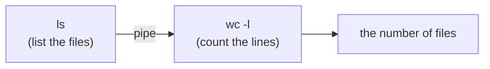

# Notes — M3: the command line

That "scary black screen" is the most precise, powerful way to control a computer — and once it clicks, it's *faster* than clicking. In M2 you found files by pointing; now you'll do the same by **typing**, and unlock things a mouse can't easily do (snapping commands together). We work in a **Codespace** — a ready-made Linux terminal in your browser — so the whole class is on the exact same machine (no "works on my laptop" surprises).

## The terminal, the shell, and the prompt
Three words, three things:
- The **terminal** is the *window* you type into.
- The **shell** is the *program inside it* that reads your commands and tells the OS to run them. The common one (and the one in your Codespace) is **bash**.
- The **prompt** — text ending in `$` — means *"ready, type something."*

You're now driving a **Linux** shell — the same kind that runs most of the servers behind the internet. The skills here transfer straight to real engineering work.

## Errors are safe — really
The most important thing on day one: **you can't break anything by typing a command name.** Type nonsense and you get a shrug:

```text
$ helllo
bash: helllo: command not found
$
```

Nothing happens; it just waits. Two lifesavers: **↑ (up-arrow)** recalls your last command, and **Tab** auto-completes a half-typed name. This screen is your playground.

## A command and its parts
A **command** is a word that makes something happen. It usually takes:
- **arguments** — *what* to act on (a file or folder), and
- **options** (or **flags**) — *how* to do it, usually a dash and a letter.

In `ls -l Documents`: `ls` is the command, `-l` is an option ("long, detailed listing"), `Documents` is the argument. Options can combine (`ls -la`) and many have long forms (`--all`).

## Finding your way: `pwd`, `ls`, `cd`
Your files are a tree, and you're always standing *inside* one folder — the **current working directory**. Three commands are your eyes and feet:


| Command | Means |
|---|---|
| `pwd` | "where am I?" — prints the current folder's **path** |
| `ls` | "what's here?" — lists this folder's contents |
| `cd folder` | "go in there" |

Plus `cd ..` (up one level) and `cd` alone (home). Those **paths** are exactly what you read in M2's file manager — now you type them.

## Making things happen: `mkdir`, `cp`, `mv`, `rm`
| Command | Does |
|---|---|
| `mkdir practice` | **make** a folder |
| `cp a.txt b.txt` | **copy** a file |
| `mv a.txt b.txt` | **move** — or **rename** (same command) |
| `rm a.txt` | **remove** (delete) — **permanent** |

> ⚠️ `rm` has **no Recycle Bin** — a removed file is gone. Read the name twice. (And `ls -l` shows each file's **permissions** — the `-rw-r--r--` code — which you'll decode in M4.)

## The superpower: combining commands
Here's what makes the command line more powerful than clicking — and it's the part most "intro" courses skip.

**Redirection (`>`)** sends a command's output into a **file** instead of the screen:
```text
$ echo "line one" > log.txt      # > writes (replaces)
$ echo "line two" >> log.txt     # >> adds to the end
```

**A pipe (`|`)** sends one command's output straight into *another command* as its input:
```text
$ ls | wc -l        # list files, then count the lines = how many files
```



This is the whole philosophy: each command does **one** small thing well, and you **snap them together** like Lego to do big things — count, filter, transform. `ls /usr/bin | wc -l` tells you how many programs are installed; `ls -l | grep txt` lists only your `.txt` files. That composability is the root of modern automation.

## You look commands up — you don't memorize them
Nobody memorizes every command. You keep a **cheat-card** and look things up (and `command --help` or `man command` explains any of them). The handful you'll actually use daily: `pwd`, `ls`, `cd`, `mkdir`, `cp`, `mv`, `rm`, `cat`, `grep`. Keep the **[Linux commands cheat-card](../resources/cheat-cards/linux-commands.md)** open while you work.

## See it yourself
In your Codespace terminal: run `pwd` (where am I), `ls` (what's here), make a file with `echo "hi" > hi.txt`, then count your files with `ls | wc -l`. You just stored output in a file and chained two commands.

<details>
<summary><b>Go deeper (optional — not needed for today's win)</b></summary>

- Every command has three streams: **stdin** (input), **stdout** (normal output), **stderr** (errors). `>` and `|` are just rerouting stdout.
- The shell is a real **programming language** — variables, loops, and scripts — which is how repetitive work gets **automated** (a whole topic later).
- `*` is a **wildcard**: `rm *.tmp` removes every file ending in `.tmp`. Powerful — handle with care.
</details>

---
**New words** (also in `resources/glossary.md`): pipe, redirection. (Plus the M3 basics: terminal, shell, prompt, command, argument, option/flag, path, current working directory, Tab completion.)

**Source:** original — written for this course. The commands were verified by running them in the course's Linux (Codespaces) environment. The cheat-card draws on a public Linux-commands reference (linked there).
