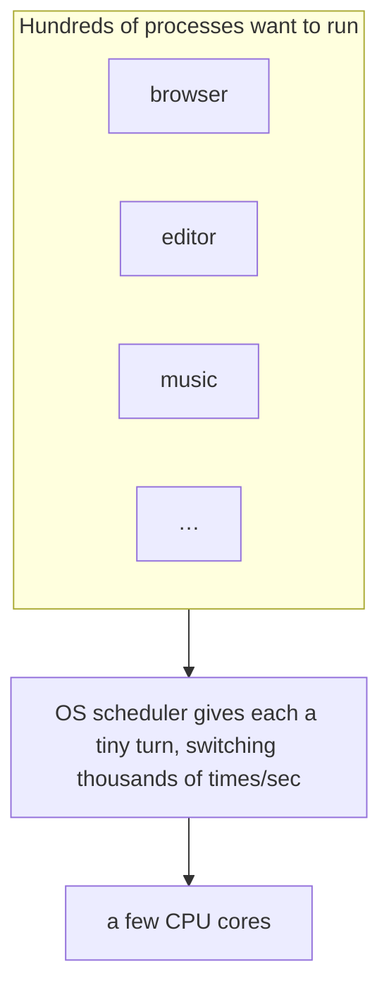
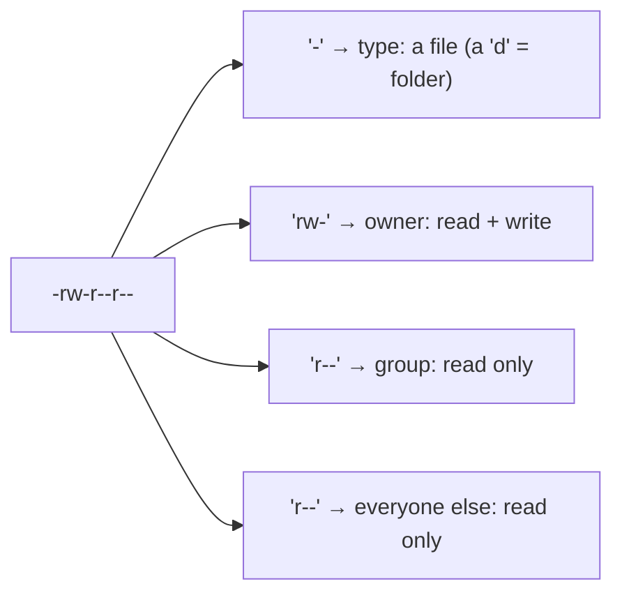

**## M4: inside the OS, what's really happening**

In M2 you watched the OS boot and organize files. Right now it's doing something busier and invisible: juggling **hundreds** of running programs across a handful of CPU cores, parcelling out memory, and enforcing who's allowed to touch what. This module makes all of that visible and you'll meet the exact OS trick that makes **containers** (M10) possible.

**## Processes: every running program**
A program sitting in storage is just a file. The moment it runs, the OS turns it into a **process** and computer processes are running program with its own slice of CPU time and memory, and an ID number called a **PID** (process ID). Your computer has *hundreds* of processes going at once, most of them quietly in the background (those background ones are called **daemons**). **A computer daemon is a program that runs continuously in the background, independently of any direct user control, Common examples include the sshd daemon (for secure remote login) and the crond daemon (for executing automated, scheduled scripts)**

**## Multitasking & scheduling: a few cores, hundreds of programs**
Here's a puzzle: in M1 you found maybe 4–8 CPU cores, yet hundreds of programs run "at once." How?

The OS includes a **scheduler** that rapidly switches each core between processes, giving each a tiny slice of time, thousands of times a second. It's so fast it *looks* simultaneous and that's **multitasking**. (True parallelism — genuinely at once — only happens up to your core count; the scheduler fakes the rest by taking turns.)

This is also why one frozen app usually doesn't freeze the whole machine: the scheduler keeps handing the other processes their turns.

**## Memory: RAM, and the swap trick**
Every running process takes a slice of **RAM** (M1). The OS tracks exactly how much each one uses. When RAM fills up, the OS doesn't just crash: it uses **swap** (a.k.a. virtual memory), parking some data on storage to free RAM. It's much slower (storage isn't RAM), which is **why** a computer crawls when memory runs low, but it keeps things alive. (Callback to M2: the OS managing resources behind the scenes.)

**To View Virtual Memory Size (GUI) on WINDOWS:**

- Press Win + R, type systempropertiesadvanced and press Enter.

- Under the Advanced tab, click Settings in the Performance section.

- Switch to the Advanced tab in the Performance Options window.

- Look at the Virtual memory section to see the total paging file size.

**For MAC**

- Press Cmd + Spacebar to open Spotlight, type Activity Monitor, and press Enter.

- Click the Memory tab at the top of the window.

- Look at the bottom of the window. You will see a statistic labeled Swap Used. This indicates how much data the system has offloaded from physical RAM onto your SSD or hard drive.

When your computer feels sluggish, it's usually one greedy process hogging CPU or memory and you can find it.

**## Seeing and controlling what's running**
The OS lets you look and intervene. In your Codespace's Linux terminal:

- `ps` takes a **snapshot** of processes; `ps aux --sort=-%mem` sorts them by memory called the hog floats **(A memory hog is any computer program or process that consumes an excessively large amount of RAM (Random Access Memory). When a program takes up too much memory, it leaves fewer resources for other applications, which can cause your system to slow down, freeze, or display "out of memory" errors.)** to the top.
  
- `top` shows a **live**, self-updating view (press `q` to quit).
  
- `kill <PID>` stops **one** process by its ID; `Ctrl-C` stops a program running in your terminal.

The lesson: when an app freezes, you don't reboot the whole machine just find that one process and stop it. Everything else keeps running.

**## Users & permissions: who can touch what**
Computers are **multi-user** by design, so every file carries **permissions**: separate rights for its **owner**, its **group**, and **everyone else**, each able to **read (r)**, **write (w)**, or **execute (x)**. Run `ls -l` and you see the code:

`chmod` changes these; `id` tells you who you are. This is why you sometimes get **"Permission denied"** — and it's a *feature*: the principle of **least privilege** (give each user/program only the access it needs) is the foundation of keeping a system safe (much more in M6). One special account, the **superuser** (*root* / admin), can override anything — which is why installing software asks for your password (`sudo`).

**## The trick behind containers (namespaces & cgroups)**
This is the modern payoff. The OS can hand a process a **fenced-off view of the machine** its own files, its own list of processes, its own slice of resources, so it **believes** it has the computer to itself. On Linux this is done with two features:

- **Namespaces**: limit what a process can **see** (its own filesystem, process list, network). Use command **lsns or man lsns** (for manual guides)
  
- **Control groups (cgroups)**: limit what a process can **use** (how much CPU and memory). Use command **systemd-cgls**

  **NB:**
      Linux namespaces and control groups (cgroups) represent the foundational **kernel (computer kernel is the core, foundational program of an operating system. It acts as a bridge between your software applications and physical hardware)** technologies enabling **containerization (A container is a standard unit of software that packages up code and all its dependencies so the application runs quickly and reliably from one computing environment to another.)**, resource isolation, and multi-tenant computing that power modern cloud infrastructure. While Docker, Kubernetes, and other container platforms provide user-friendly abstractions, understanding the underlying namespace and cgroup mechanisms distinguishes platform users from infrastructure engineers capable of building custom isolation solutions, troubleshooting complex container issues, and architecting secure multi-tenant systems.

Namespaces provide process isolation by creating separate views of system resources and processes in different namespaces cannot see or interact with each other's resources, enabling applications to run with independent network stacks, filesystem hierarchies, process trees, and user/group mappings. This isolation forms the security boundary between containers, preventing privilege escalation and resource interference.

Cgroups (control groups) enable resource accounting, limitation, and prioritization—controlling how much CPU, memory, disk I/O, and network bandwidth processes can consume. Combined with namespaces, cgroups provide the complete isolation and resource management framework that containerization depends upon.

- That exact pair **namespaces + cgroups** is how a **container** works (M10). A container isn't a tiny computer inside yours; it's the OS boxing an ordinary process with namespaces and cgroups. You're learning the engine now; M10 just drives it.

**## See it yourself**
In your Codespace: `nproc` (your cores), `free -h` (memory in use vs free), `top` (live processes — `q` to quit), `ps aux --sort=-%mem | head` (your biggest memory users), `ls -l` (permissions), and `id` (who you are).

<b>Go deeper (optional — not needed for today's win)</b>

- Processes have **states**: *running*, *sleeping* (waiting), or *zombie* (finished but not cleaned up).
  
- You can nudge how much CPU a process gets its **priority** ("niceness").
  
- `kill` actually sends a **signal**; `kill -9` is the forceful "stop now" version.
  
- Recall **threads** from M1: one process can have several threads sharing its memory.

------------------------------------------------------------------------------------------

## Check yourself
Lock in today's win — answer each in your head (or out loud), then reveal.

**1. You only have a few CPU cores, yet hundreds of programs seem to run at once. How does the OS pull this off?**

??? success "Show answer"
    The OS includes a **scheduler** that rapidly switches each core between processes, giving each a tiny slice of time thousands of times a second. It's so fast it *looks* simultaneous that's **multitasking**. (True parallelism only happens up to your core count.)

**2. What is a process, and what's the difference between it and a program sitting in storage?**

??? success "Show answer"
    A program in storage is just a file. The moment it runs, the OS turns it into a **process** — a running program with its own slice of CPU time and memory, plus an ID number called a **PID**.

**3. What does the OS do when RAM fills up, and why does this make your computer feel slow?**

??? success "Show answer"
    It uses **swap** (virtual memory), parking some data on storage to free up RAM instead of crashing. Storage is much slower than RAM, which is *why* the computer crawls when memory runs low but it keeps things alive.

**4. When an app freezes, why don't you need to reboot the whole machine?**

??? success "Show answer"
    The **scheduler** keeps handing the other processes their turns, so one frozen app usually doesn't freeze everything. You can find that one process (with `ps` or `top`) and stop it with `kill <PID>`, and everything else keeps running.

**5. What are the two OS features behind containers, and what does each one do?**

??? success "Show answer"
    **Namespaces** limit what a process can **see** (its own filesystem, process list, network), and **control groups (cgroups)** limit what a process can **use** (how much CPU and memory). That exact pair is how a **container** works.

---
**New words** (also in `resources/glossary.md`): scheduler, swap, namespace, control group (cgroup). (Plus the M4 basics: process, PID, multitasking, permissions, owner/group/world, superuser, daemon.)

**Source:** original written for this course. Commands were verified by running them in the course's Linux (Codespaces) environment; the diagrams are original.
