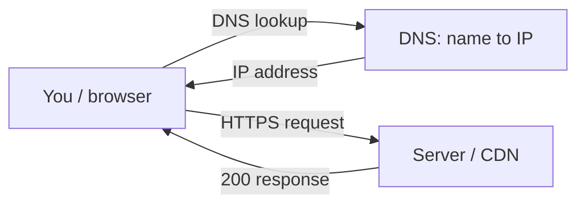

# Lab — M5: trace a website end-to-end (in your Codespace)

**You'll need:** your **Codespace** terminal and a normal **browser** tab. **Nothing to install.**
New to the Codespace? See **[How to open it](../../resources/install-guides/codespaces.md)**.
**Time:** ~30 minutes • **Work in your breakout pair** — compare what each of you gets.

> Heads up: every command here just *asks the network a question* and reads the answer — nothing
> changes your machine. We'll follow one site, `example.com`, on its whole journey. The same trip
> happens for **every** site you visit.

### The trip you'll trace
Every site you open makes this round trip — you'll do each leg by hand:


---

## Step 1 — Open your terminal
In your Codespace, the **Terminal** panel is at the bottom.

✅ **You should now see:** a prompt ending in `$`.

## Step 2 — Turn the name into an address (DNS)
Computers find each other by number, not name. **DNS** does the lookup:
```text
$ dig +short example.com
```

✅ **You should now see:** one or more **IP addresses** (e.g. `104.20.23.154`). **The name just became a number.** (Your partner may see different IPs — big sites have many.)

## Step 3 — Send a request, read the response (over HTTPS)
Your browser asks a server for a page; you can do it by hand. Ask for just the response status first:
```text
$ curl -I https://example.com
```

✅ **You should now see:** a first line **`HTTP/2 200`**. The **`200`** means *success — here's your page*. The **`https`** means the whole exchange was **encrypted** (the padlock). You just sent a **request** and read the **response**.

## Step 4 — See the actual page
```text
$ curl https://example.com
```

✅ **You should now see:** a wall of **HTML** including `<title>Example Domain</title>`. That's the raw page your browser normally *draws* for you.

## Step 5 — Decode the padlock (the certificate)
1. In a **browser tab**, open `https://example.com`.
2. Click the **padlock 🔒** in the address bar → **Connection is secure** → **Certificate**.

✅ **You should now see:** the site's **TLS certificate** — who it's issued *to* (example.com), who issued it (a trusted authority — here, **Cloudflare**), and its **valid dates**. That certificate is how your browser knows the server is the real one.

## Step 6 — Watch the browser do all of it
Still in the browser: open **Developer Tools** (**F12** or right-click → Inspect), click the **Network** tab, and **reload** the page.

✅ **You should now see:** a request row with **Status `200`** — the same 200 you got in the terminal. You're watching the browser make the exact request you made by hand.

## Step 7 — Spot the CDN (the modern bit)
Run this and look at the `server:` line:
```text
$ curl -sI https://example.com | grep -i server
```

✅ **You should now see:** `server: cloudflare`. `example.com` isn't one computer — it's served by **Cloudflare, a CDN** (copies on servers worldwide) so it loads fast from anywhere. That's the cloud in action (M8).

> *(Optional, on your **own** computer — not the Codespace: `ping example.com` shows round-trip time. Codespaces blocks `ping` for security, so it won't respond there — `dig`/`curl` are the reliable trace.)*

---

## 🎉 Your win
You traced a website end-to-end: **DNS** turned the name into an address, your **request** got a
**200 response** over **HTTPS**, you **decoded the padlock**, and you spotted the **CDN** serving it.
That's what happens *every* time you open a website.

**Post it to the chat wins board:** *"example.com → `____`, answered 200 OK over HTTPS 🔒, served by Cloudflare 🎉"*

## Take-home (optional)
`dig +short` three sites you love. Do any share an IP or the same CDN (`curl -sI … | grep server`)?
Many sites hide behind the same few big providers — you can see it right in the numbers.
