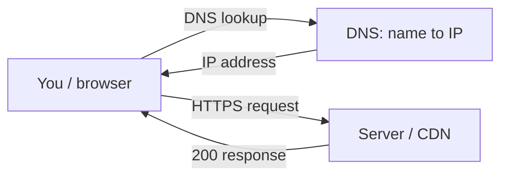

**# Lab M5: trace a website end-to-end (in your Codespace)**

**You'll need:** your **Codespace** terminal and a normal **browser** tab. **Nothing to install.**
New to the Codespace? See **[How to open it](../../resources/install-guides/codespaces.md)**.
**Time:** ~30 minutes • **Work in your breakout pair** compare what each of you gets.

**### The trip you'll trace**
Every site you open makes this round trip you'll do each leg by hand:


---

## Step 1: Open your terminal
In your Codespace, the **Terminal** panel is at the bottom.

**You should now see:** a prompt ending in `$`.
```text
$ docker run -d -p 8080:80 kennethreitz/httpbin ##Download and run httpbin on codespace
```

**## Step 2: Turn the name into an address (DNS)**
Computers find each other by number, not name. **DNS** does the lookup:
```text
$ dig +short http://localhost:8080 #Use any website 
```

**You should now see:** one or more **IP addresses** (e.g. **`104.20.23.154`**). **The name just became a number.** (Others may see different IPs big sites have many). Big sites use multiple IP addresses primarily to handle massive traffic, prevent crashes, and speed up loading times. Instead of relying on one server, they distribute visitors across a global network of servers using load balancers and Content Delivery Networks **(CDNs)**. 

## Step 3: Send a request, read the response (over HTTPS)
Your browser asks a server for a page; you can do it by hand. Ask for just the response status first:
```text
$ curl -v http://localhost:8080
```
When you use curl -v http://localhost:8080/get, the output contains three distinct phases: The Connection, The Request, and The Response.

***Anatomy of an HTTP ExchangeHere is exactly what happens behind the scenes for a standard request.***
```
* Trying 127.0.0.1:8080...
* Connected to localhost (127.0.0.1) port 8080
> GET /get HTTP/1.1
> Host: localhost:8080
> User-Agent: curl/8.4.0
> Accept: */*
> 
< HTTP/1.1 200 OK
< Server: gunicorn/19.9.0
< Date: Wed, 22 Jul 2026 08:05:00 GMT
< Content-Type: application/json
< Content-Length: 256
< 
{ "args": {}, "headers": { "Accept": "*/*" } }
```

**1. The Connection Phase (*)Lines starting with * are debug logs generated by curl itself.** 
They tell you that curl successfully resolved localhost to the IP address 127.0.0.1 and opened a raw TCP socket on port 8080

**2. The Request Header Phase (>)**
  Lines starting with > are the bytes your machine sent to Httpbin.

  - GET /get HTTP/1.1: This is the Request Line. It states the action (GET), the path (/get), and the protocol version (HTTP/1.1).

  - Host: localhost:8080: Tells the server which specific domain/port name you are targeting. This is mandatory in HTTP/1.1.

  - User-Agent: Identifies the client software making the request (in this case, curl).

  - Accept: */*: Tells the server that your client can handle any format of return data (text, JSON, images).

**3. The Response Header Phase (<)**
  Lines starting with < are the metadata sent back by Httpbin before the actual content arrives.

  - HTTP/1.1 200 OK: This is the Status Line. It contains the protocol, the Status Code (200), and the Reason Phrase (OK).

  - Content-Type: application/json: Tells your client that the body data is structured as JSON, so your machine knows how to parse it.

  - Content-Length: 256: The exact size of the payload body in bytes.

**Understanding HTTP Status Codes**

  Servers use three-digit numbers to instantly communicate the outcome of your request. They fall into five strict categories:

  - 200 OK: The request succeeded. The server gathered the data and appended it to the response body.

  - 201 Created: The request succeeded, and a new resource was successfully generated on the server (common after POST requests).

  - 204 No Content: The request succeeded, but there is intentionally no body data to return (common after a successful DELETE).

**3xx Redirection (The Resource Moved)**

  - 301 Moved Permanently: The target URL has changed forever. The response will include a Location: header pointing to the new address.

  - 302 Found / Temporary Redirect: The resource is temporarily living somewhere else, but you should keep using the original URL in the       future.

**4xx Client Errors (You Made a Mistake)**

  - 400 Bad Request: The server cannot understand your request because your syntax is broken (e.g., malformed JSON payload).

  - 401 Unauthorized: You lack valid authentication credentials for the target resource.

  - 403 Forbidden: The server knows exactly who you are, but you explicitly do not have permission to access this specific data.

  - 404 Not Found: The server cannot find any resource matching the URL path you provided.

**5xx Server Errors (The Server Crashed)**

  - 500 Internal Server Error: The server encountered an unexpected error or code crash while processing your request.

  - 502 Bad Gateway: The master server received an invalid, broken response from an underlying upstream server or database.

  - 503 Service Unavailable: The server is currently overloaded with traffic or down for scheduled maintenance.
  

## Step 4 — See the actual page
```text
$ curl http://localhost:8080
```

 **You should now see:** a wall of **HTML** including `<title>Example Domain</title>`. That's the raw page your browser normally *draws* for you.

## Step 5: Decode the padlock (the certificate)
  1. In a **browser tab**, open `http://localhost:8080`.
  2. Click the **padlock 🔒** in the address bar → **Connection is secure** → **Certificate**.

  **You should now see:** the site's **TLS certificate** — who it's issued *to* **(localhost:8080)**, who issued it (a trusted authority     here, **Cloudflare**), and its **valid dates**. That certificate is how your browser knows the server is the real one.

## Step 6: Watch the browser do all of it
Still in the browser: open **Developer Tools** (**F12** or right-click → Inspect), click the **Network** tab, and **reload** the page.

  **You should now see:** a request row with **Status `200`** — the same 200 you got in the terminal. You're watching the browser make the   exact request you made by hand.

## Step 7: Spot the CDN (the modern bit)
Run this and look at the `server:` line:
```text
$ curl -sI https://example.com | grep -i server
```

**You should now see:** `server: cloudflare`. `example.com` isn't one computer — it's served by **Cloudflare, a CDN** (copies on servers worldwide) so it loads fast from anywhere. That's the cloud in action (M8).

**## Exploring Advanced curl Syntaxes**

  **1 Inspect Custom Response Headers**
  You can tell Httpbin to mimic any error code you want by appending it to the /status path:
  ```text
      curl -v http://localhost:8080/status/403
```
  Look at the response header lines (<). You will see HTTP/1.1 403 FORBIDDEN explicitly thrown by your container.

  **2 Inspect Custom Response Headers**
      You can inspect specific structural items by passing query parameters:
```text
      curl -v "http://localhost:8080/response-headers?Content-Type=text/plain&My-Custom-Header=HelloCodespace"
```
  Check the response headers. You will see your injected My-Custom-Header echoed right back to you in the system metadata.

  ***3 Inspect a Redirect Chain**
    By default, curl will stop if it encounters a 302 Redirect. To force curl to follow the trail to the final landing destination, use       the -L (or --location) flag:

``` text
      curl -v -L http://localhost:8080/redirect/2
```


---

## 🎉 Your win
You traced a website end-to-end: **DNS** turned the name into an address, your **request** got a
**200 response** over **HTTPS**, you **decoded the padlock**, and you spotted the **CDN** serving it.
That's what happens *every* time you open a website.

**Post it to the chat wins board:** *"example.com → `____`, answered 200 OK over HTTPS 🔒, served by Cloudflare 🎉"*

## Take-home (optional)
`dig +short` three sites you love. Do any share an IP or the same CDN (`curl -sI … | grep server`)?
Many sites hide behind the same few big providers — you can see it right in the numbers.
