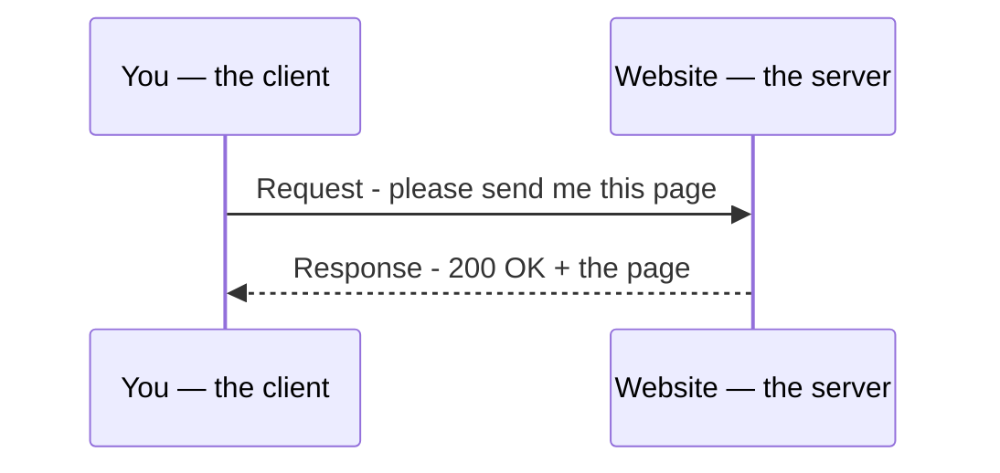
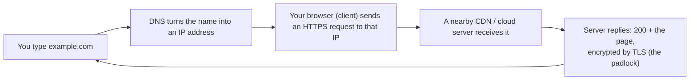

# Notes — M5: networking & the web

You type a name, hit Enter, and a page from a computer on the other side of the planet appears in under a second. This module traces *exactly* what happens in those moments — the address lookup (**DNS**), the **request and response**, the padlock (**HTTPS**), and why it's all so fast (**CDNs**). By the end, the web isn't magic — it's a sequence you can name.

## Internet vs web — not the same thing
People say them interchangeably, but:
- The **internet** is the global *network of networks* — the roads. (M1's "data center → cloud" computers, all wired together.)
- The **web** is *one thing that runs on* the internet: websites and pages. Email, video calls, app updates, and game servers also ride the same internet — the web is just the most visible passenger.

## Every device has an address: the IP
For a message to reach the right computer, each one needs a unique **IP address** — like `172.66.147.243`. The classic style (IPv4) is four numbers; a newer style (IPv6) is much longer and far more plentiful. Without an address, a reply has nowhere to go.

## DNS — the internet's phone book
You don't memorize `172.66.147.243`; you type `example.com`. The system that turns the *name* into the *number* is **DNS** (Domain Name System). Every time you open a site, your computer quietly asks DNS "what's the IP for this name?" first. (You'll do that lookup by hand in the lab with `dig`.)

## Client & server: request → response
Opening a page is a quick conversation:

Your device is the **client** — it sends a **request**. A **server** (a computer whose job is to serve pages) sends back a **response**, starting with a status like **`200`** (success). That request→response loop is the heartbeat of the web, and **HTTP** is the language they speak.

## HTTPS & TLS — what the padlock means
Plain **HTTP** is like a postcard: anyone who handles it along the way can read it. **HTTPS** is HTTP wrapped in **TLS encryption** — it scrambles the connection so only you and the server can read it. The **padlock** in your address bar means HTTPS is on.

How does your browser know the server is *really* `example.com` and not an impostor? A trusted authority issues the site a **TLS certificate** — a verifiable ID card. Your browser checks it automatically; you can inspect it yourself (who it's for, who issued it, and its valid dates). Modern reality: **HTTPS is now everywhere**, and browsers warn loudly on plain HTTP.

## How it physically travels: packets & routers
Your request isn't sent as one lump — it's broken into small **packets**. **Routers** forward each packet hop by hop across networks until it arrives, where they're reassembled. (Same idea whether it's across the room or across an ocean.)

## CDNs & the cloud — why it's fast and global
A big website isn't one computer in one place. It's copies cached on many servers worldwide — a **CDN** (content delivery network) — so you connect to a *nearby* one instead of a distant origin. That's why a site loads quickly whether you're in Lagos or London. Real example: `example.com` is actually served by **Cloudflare**, a CDN — you'll see "server: cloudflare" in the lab. This is "the cloud" doing its job (much more in M8).

## Ports — many services, one computer
A **port** is a numbered "door" a program listens at. The web uses **port 80** for HTTP and **port 443** for HTTPS. One server can run many services at once by listening on different ports.

## The whole trip, end to end

That entire chain runs every time you open a website — usually faster than you can blink.

## See it yourself
In your Codespace: `dig example.com` (watch the name become an IP), then `curl -I https://example.com` (see the `200` response come back over HTTPS). In a browser, click the **padlock** to read the site's certificate.

<b>Go deeper (optional — not needed for today's win)</b>

- **TCP/IP** is the family of rules underneath: IP addresses & routes packets; TCP guarantees they all arrive, in order (via a "handshake").
- Status codes you'll meet: **200** OK, **301/302** redirect, **404** not found, **500** server error.
- TLS sets up a shared secret key at the start so the rest of the conversation is encrypted — without ever sending the key in the clear.
- Big sites add **load balancers** to spread requests across many servers.

---

## Check yourself
Lock in today's win — answer each in your head (or out loud), then reveal.

**1. What's the difference between the internet and the web?**

??? success "Show answer"
    The **internet** is the global network of networks — the "roads" connecting all the computers. The **web** is just one thing that runs on the internet: websites and pages. Email, video calls, and game servers ride the same internet too.

**2. When you type a name like `example.com`, what turns that name into a number the computer can reach?**

??? success "Show answer"
    **DNS** (Domain Name System) — the internet's phone book. It turns the *name* into the **IP address** (like `172.66.147.243`) that messages are actually sent to.

**3. What does the padlock in your address bar actually mean?**

??? success "Show answer"
    It means **HTTPS** is on — plain **HTTP** wrapped in **TLS encryption**, which scrambles the connection so only you and the server can read it. A trusted **TLS certificate** also proves the server really is who it claims to be.

**4. Describe the request → response loop between client and server.**

??? success "Show answer"
    Your device is the **client** and sends a **request** ("please send me this page"). A **server** sends back a **response**, starting with a status like **`200`** (success). That loop, spoken in **HTTP**, is the heartbeat of the web.

**5. Why does a website load fast whether you're in Lagos or London?**

??? success "Show answer"
    Because of a **CDN** (content delivery network) — copies of the site cached on many servers worldwide, so you connect to a *nearby* one instead of a distant origin. `example.com` is actually served by **Cloudflare**, a CDN.

---
**New words** (also in `resources/glossary.md`): HTTPS, TLS, TLS certificate, CDN. (Plus the M5 basics: internet, IP address, DNS, client, server, request/response, HTTP, packet, router, port.)

**Source:** original — written for this course. Commands and the certificate inspection were verified by running them against a live site in the course's Linux (Codespaces) environment; the diagrams are original.
