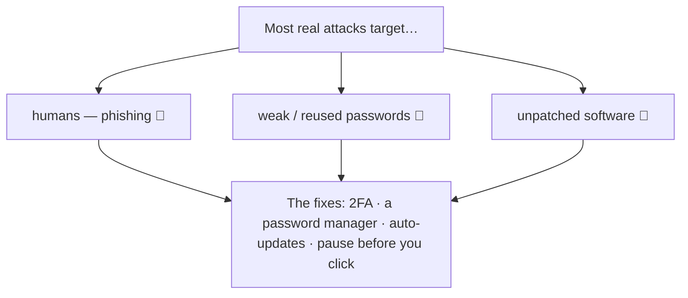
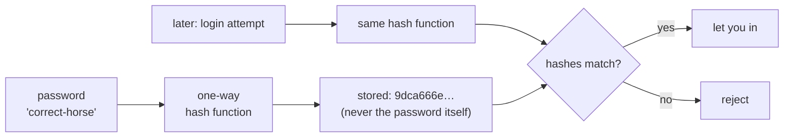

# Notes — M6: security & privacy

Everything you've built so far — files, the network, the web — is also a *target*. The good news, and the theme of this module: **most attacks aren't movie-hacker wizardry.** They exploit weak passwords, missing updates, and tricking *you*. All fixable with a handful of habits. We'll build a simple threat model, see how protection actually works, and you'll watch a password become an unreadable hash with your own eyes.

## A simple threat model
"Security" means protecting three things — easy to remember as **C-I-A**:
- **Confidentiality** — keep secrets secret (your messages, passwords, data).
- **Integrity** — nobody tampers with your data without you knowing.
- **Availability** — your stuff stays usable (not locked up by ransomware).

A threat model is just three honest questions: **what's valuable** (your email, money, photos), **who wants it** (mostly scammers running numbers, not targeted geniuses), and **how do they get in?** The reassuring answer:



## Authentication: proving it's you
A **password** proves you're you — but only if it's strong and unique. The two real problems are **reuse** (one leak unlocks everything) and **weak** passwords.

**How passwords are *really* stored** (this surprises people): a good system never stores your password. It stores a **hash** — a scrambled, one-way fingerprint. Feed the same password in, you always get the same hash; but you **cannot** run it backwards to recover the password, and changing a single character produces a *completely* different hash. So a leaked database (if built right) reveals hashes, not your actual password. You'll see this live in the lab.



Two habits beat almost everything:
- **A password manager** — it generates and remembers a unique, long password for every site. (Length matters more than symbols: a long passphrase beats `P@ss1!`.)
- **Two-factor authentication (2FA)** — a second proof (a code from an app, or a hardware key) so a stolen password alone isn't enough. Turn it on for your **email first** — email is the master key, because "reset password" links go there.

## Encryption: scrambling data so others can't read it
- **In transit:** **HTTPS/TLS** (from M5) scrambles data while it crosses the network, so someone watching the Wi-Fi sees gibberish. That's the padlock.
- **At rest:** **disk encryption** (FileVault on Mac, BitLocker on Windows) scrambles what's on your drive, so a stolen laptop is a brick, not a data leak.

Encryption vs hashing: **encryption is reversible** with the right key (for data you need back); **hashing is one-way** (for passwords and integrity checks).

## Phishing & social engineering: hacking the human
The number-one way people actually get compromised isn't code — it's a convincing message that tricks you into handing over a password or clicking malware. Red flags:
- **Urgency or threats** ("your account will be closed in 24 hours!").
- **A mismatched sender** — the display name says "Bank" but the address is `secure@bank-alerts.ru`.
- **Links that don't match** — hover and the real destination is different from the text.
- **Generic greetings**, unexpected attachments, or requests for credentials.

The unbreakable rule: **never enter a password from a link in a message.** Go to the site yourself, or verify through a separate channel.

## Least privilege: shrink the blast radius
Callback to M4's permissions: run as a **normal user, not an admin/root**. If malware runs as a limited user, it can mess up *your* files but not the whole system; if it runs as admin, it owns everything. This is why apps ask permission, why `sudo` exists, and why you don't browse the web as administrator. **Give every user and program only the access it needs** — the single most important security principle, and it scales all the way to the cloud (M8).

## Keep it patched
Most breaches exploit **known** bugs that *already have fixes*. Updating isn't nagging — it's closing doors attackers are actively walking through. Turn on **auto-updates** for your OS, browser, and apps.

## Privacy basics
Your data is constantly collected and sold. Minimize what you share, review app permissions (does a flashlight app need your contacts?), and check whether your accounts have appeared in a breach (e.g. *Have I Been Pwned*).

## See it yourself
In your Codespace, turn a "password" into a hash and watch the avalanche effect:
```text
$ echo -n "correct-horse" | sha256sum
$ echo -n "correct-horsf" | sha256sum     # one letter different
```
Then, on your own accounts: confirm **2FA is on for your email**, and skim your inbox for a message with the red flags above.

<details>
<summary><b>Go deeper (optional — not needed for today's win)</b></summary>

- **Public-key crypto** is how HTTPS shares a secret key safely without ever sending it in the clear.
- The **OWASP Top 10** is the industry's list of the most common web-app weaknesses (you'll meet it again if you build apps in Course 02).
- **Ransomware** attacks *availability* — it encrypts your files and demands payment; good backups are the defense.
- **Zero trust** is the modern stance: never assume anything inside the network is safe — verify everything.
</details>

---

## Check yourself
Lock in today's win — answer each in your head (or out loud), then reveal.

**1. What are the three things "security" protects, and what does each one mean?**

??? success "Show answer"
    The **C-I-A** trio: **Confidentiality** (keep secrets secret), **Integrity** (nobody tampers with your data without you knowing), and **Availability** (your stuff stays usable, e.g. not locked up by ransomware).

**2. Most real attacks aren't movie-hacker wizardry — so what do they actually exploit, and what habits fix them?**

??? success "Show answer"
    They mostly exploit **humans (phishing)**, **weak or reused passwords**, and **unpatched software**. The fixes are simple habits: **2FA**, a **password manager**, **auto-updates**, and pausing before you click.

**3. How does a good system store your password, and why is that safer if the database leaks?**

??? success "Show answer"
    It never stores the password itself — it stores a **hash**, a scrambled, one-way fingerprint. You **can't run it backwards** to recover the password, so a leaked database (if built right) reveals only hashes, not your actual password.

**4. What's the difference between encryption and hashing?**

??? success "Show answer"
    **Encryption is reversible** with the right key — used for data you need to get back (like **HTTPS/TLS** in transit or **disk encryption** at rest). **Hashing is one-way** — used for passwords and integrity checks.

**5. What's the unbreakable rule for avoiding phishing?**

??? success "Show answer"
    **Never enter a password from a link in a message.** Instead, go to the site yourself or verify through a separate channel — watch for red flags like **urgency**, a **mismatched sender**, and **links that don't match**.

---
**New words** (also in `resources/glossary.md`): threat model, authentication, hash, two-factor authentication (2FA), password manager, encryption, phishing, least privilege, patching.

**Source:** original — written for this course. The hashing demonstration was verified by running it in the course's Linux (Codespaces) environment; the diagrams are original.
