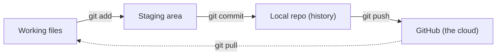

# Lab — M7: your first repo, on GitHub (in your Codespace)

**You'll need:** your **Codespace** (Git is pre-installed and signed in to GitHub). **Nothing to install.**
New to it? See **[How to open your Codespace](../../resources/install-guides/codespaces.md)**.
**Time:** ~30 minutes • **Work in your breakout pair.**

> Heads up: Git is almost all undo-able — commit early and often, you can't really lose work.
> Use `git status` any time you're unsure what's going on.

### The flow you'll build
Your edits move through four places — each step below is one of these arrows (branch & merge happen inside your local repo):


---

## Step 1 — Tell Git who you are (one time)
Codespaces usually already know you, but to be safe:
```text
$ git config --global user.name "Your Name"
$ git config --global user.email "you@example.com"
```

✅ **You should now see:** no error (silence = success). Git now stamps your name on each commit.

## Step 2 — Start a project and a repo
```text
$ mkdir my-first-repo
$ cd my-first-repo
$ git init
$ git status
```

✅ **You should now see:** `Initialized empty Git repository …`, and `git status` says "No commits yet" with nothing tracked. You have an empty repo, ready to track changes.

## Step 3 — Make your first commit
```text
$ echo "# My First Repo" > README.md
$ git add README.md
$ git commit -m "First commit: add README"
```

✅ **You should now see:** a confirmation line with a short commit ID. That's snapshot #1 saved — with your message.

## Step 4 — Change something and see the diff
```text
$ echo "Learning Git in M7." >> README.md
$ git diff
```

✅ **You should now see:** the change highlighted (a green `+` line). `git diff` shows exactly what's different since your last commit.

## Step 5 — Commit the change and view history
```text
$ git commit -am "Add a description"
$ git log --oneline
```

✅ **You should now see:** **two** commits listed, newest first, each with an ID and your message. That's your history — your project's save points (commits).

## Step 6 — Branch, experiment, and merge
```text
$ git switch -c experiment
$ echo "An experimental idea." >> README.md
$ git commit -am "Try an experiment"
$ git switch main
$ git log --oneline          # main does NOT have the experiment yet
$ git merge experiment
$ git log --oneline          # now it does
```

✅ **You should now see:** on `main`, the log first shows **two** commits (the experiment is hidden on its branch); after `git merge`, it shows **three**. You tried something safely, then brought it in.

## Step 7 — Put it on GitHub
Your work is still only on this machine. Push it to the cloud (the GitHub CLI is pre-installed and signed in):
```text
$ gh repo create my-first-repo --public --source=. --push
```

✅ **You should now see:** a confirmation with a URL like `https://github.com/yourname/my-first-repo`. Open it in a browser — **your README and full commit history are now on GitHub.** That's a `push`.

---

## 🎉 Your win
You built a repo, saved commits, read the history, branched and merged, and pushed your project to
GitHub — the exact loop every software team uses every day.

**Post it to the chat wins board:** *"My first repo is live: github.com/…/my-first-repo 🎉"*

## Take-home (optional)
Make one more change on github.com itself (edit the README in the browser, commit it), then in your
Codespace run `git pull`. Watch the change come *down*. That's the other half of the loop.
