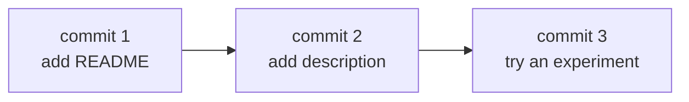
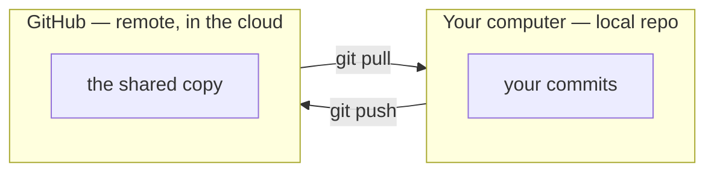

# Notes — M7: version control with Git & GitHub

Ever ended up with `report_final_v2_FINAL_actually-final.docx`? That's version control done by hand — badly. **Git** is the tool that does it properly: a time machine for your work that saves labelled snapshots you can revisit, compare, or undo. **GitHub** is where that work lives in the cloud — backed up, shareable, and ready for teamwork. Every modern software team runs on this, and you'll use it for the rest of the course.

## What version control is — and the problem it kills
Version control saves **snapshots** of your whole project over time, each with a note about what changed. So instead of a folder full of `_v2_FINAL` files, you keep **one** folder with a complete, labelled history you can rewind. You can see exactly what changed, when, and why — and undo any of it.

## Commits: snapshots with a message
The unit of history is a **commit** — a saved snapshot plus a short message. The flow is two steps:
1. **stage** the changes you want to save (`git add`),
2. **commit** them with a message (`git commit -m "what I did"`).

Each commit gets a unique ID (a hash like `4d46cef`), an author, and your message. The chain of commits *is* your history (`git log`):

## Branches: a safe parallel universe
A **branch** is a separate line of work. You branch off the main version, try something — a new feature, a risky fix — and the main version stays untouched until you're happy. Then you **merge** your branch back in. This is how you experiment safely, and how whole teams work on the same project at once without stepping on each other.

## Git vs GitHub: local vs remote
This trips people up: **Git ≠ GitHub.**
- **Git** is the *tool*, running on your own computer, tracking a **local** repository (repo).
- **GitHub** is a *service* that hosts a **remote** copy of your repo in the cloud — for backup, sharing, and collaboration. (GitLab and Bitbucket are alternatives; Git works with all of them.)

## The everyday loop
- **clone** an existing remote repo down to your machine — *or* **init** a fresh one.
- **edit → add → commit** locally, as often as you like (this all works offline).
- **push** your commits up to GitHub; **pull** to get teammates' commits down.

That's it. `clone → commit → push → pull` is the rhythm of modern software work.

## Why *everyone* uses it
Undo anything; see who changed what and why; collaborate without overwriting each other; keep an off-machine backup. It's the backbone of open source and every professional team — and it's where the rest of this course (and all of Course 02) lives.

## See it yourself
In your Codespace you'll run the whole local flow — `git init`, `git add`, `git commit`, `git log`, a branch, and a merge — then push a repo up to your own GitHub. (Codespaces usually already knows who you are, since you signed in with GitHub.)

<b>Go deeper (optional — not needed for today's win)</b>

- A **pull request (PR)** is how teams propose changes: you push a branch, open a PR, others review and discuss it, then it's merged. It's the heart of collaboration on GitHub.
- A **merge conflict** happens when two people change the same line; Git asks you to choose — it's normal, not scary.
- A **`.gitignore`** file lists things Git should *not* track (secrets, build output, the `site/` folder from our docs build).
- `git add` puts changes in a "staging area" first, so you choose exactly what goes into each commit.

---
**New words** (also in `resources/glossary.md`): version control, Git, GitHub, repository (repo), commit, branch, merge, remote, clone, push, pull.

**Source:** original — written for this course. The full local Git flow (init → commit → log → branch → merge) was verified by running it in the course's Codespaces environment; the diagrams are original.
