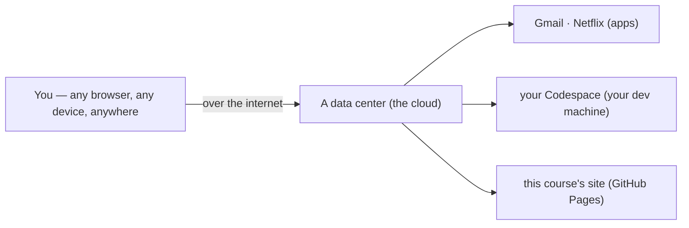
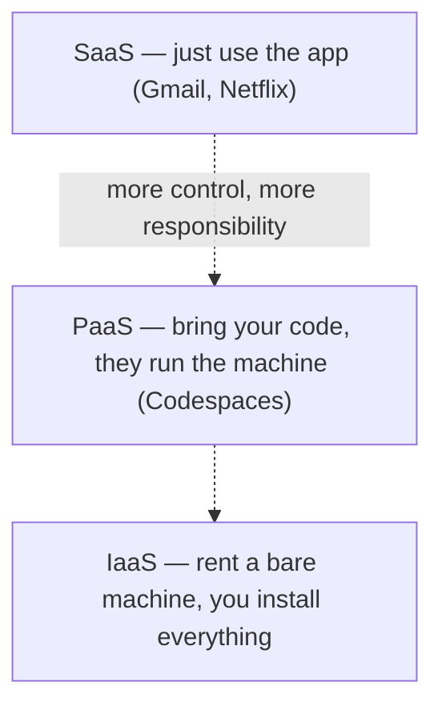

# Notes — M8: the cloud

"The cloud" sounds vague and fluffy — like your files float in the sky. They don't. **The cloud is just other people's computers that you rent over the internet** instead of owning them. And you've been using it all course: your Codespace *is* a cloud computer, and this site is served from the cloud. This module makes it concrete — what it is, its three flavors, why almost everything runs there now, and the catch.

## The cloud = renting computers on demand
Underneath the buzzword: real computers sitting in **data centers** (the warehouses of servers from M1), which you rent over the internet and pay for by usage. Turn one on in seconds, turn it off when you're done, never own the hardware. You already rely on it constantly — Gmail, Netflix, your bank's app, your Codespace, the GitHub Pages site for this course — all running on someone else's machines.

## The three flavors: IaaS, PaaS, SaaS
Cloud comes in three levels, depending on how much *they* manage vs *you*:

- **IaaS** (Infrastructure) — you rent a **bare machine** and install everything yourself. Most control, most work. (Think: an empty rented apartment.)
- **PaaS** (Platform) — you bring just your **code**; they run the machine and OS for you. (Your **Codespace** is essentially this.)
- **SaaS** (Software) — you just **use the finished app** in a browser; you manage nothing. (Gmail, Google Docs, Netflix.)

The trade-off runs one way: **SaaS is most convenient, IaaS gives most control** — pick the level that matches how much you want to manage.

## Why the cloud took over
- **Scale (elasticity):** spin up 1,000 servers for an hour during a rush, then release them. Handle a traffic spike without owning a warehouse of hardware.
- **Cost:** pay only for what you use — no buying, powering, and maintaining your own data center.
- **Anywhere access:** your compute and data are reachable from any device (you opened your Codespace from a browser — it'd be the *same* machine from your phone).
- **Speed:** a new server in seconds, not weeks of ordering hardware.

## It's physical: data centers, regions & latency
The cloud is very real estate. Providers run giant **data centers** around the world, grouped into **regions** (geographic locations). You put your app in a region near your users so data travels less distance — which lowers **latency**, the delay before a response. (Same reason a **CDN** from M5 caches copies near you.)

## The catch (it's not a free lunch)
You don't own it. That means real trade-offs: **outages** take your service down too, **prices** can change, **vendor lock-in** makes switching hard, and **your data lives on someone else's computer** (privacy and security — back to M6). Powerful, but a decision with downsides.

## The big three
Most of the cloud runs on **Amazon Web Services (AWS)**, **Microsoft Azure**, and **Google Cloud**. (Your GitHub Codespace runs on Azure.)

## See it yourself
In your Codespace terminal, `hostname` and `uname -srm` reveal it's a **Linux machine with a random name — not your laptop**, with cores and memory someone allocated you *on demand*. You reached it from a browser. That's the cloud, and you've been standing in it the whole course.

<b>Go deeper (optional — not needed for today's win)</b>

- **Serverless** takes PaaS further: you upload just a *function*, and the provider runs it only when called — you don't think about servers at all.
- **Containers + cloud** (M10): containers are how apps are actually shipped *to* the cloud and scaled across many machines.
- **Auto-scaling** adds/removes servers automatically as demand rises and falls.
- The **shared responsibility model**: the provider secures the building and hardware; *you* still secure your app, data, and passwords (M6).

---
**New words** (also in `resources/glossary.md`): cloud computing, IaaS, PaaS, SaaS, region, latency, scalability. (Plus the M8 callbacks: data center (M1), CDN (M5).)

**Source:** original — written for this course. The "your Codespace is a cloud computer" demonstration was verified by running it in the course's Codespaces environment; the diagrams are original.
